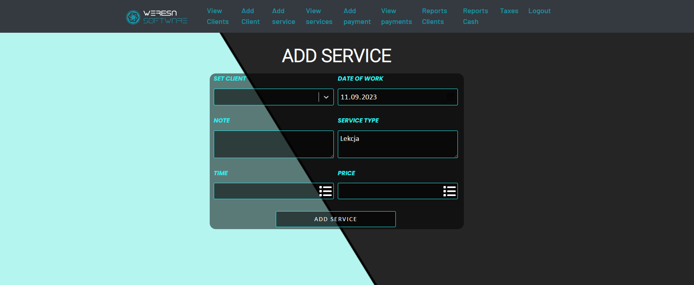

# Client resource management application.

Description: An application used to control the system of services and payments made by clients. Admin of the site has the ability to add with the appropriate forms: clients , services , taxes and payments. Admin can freely view and edit them. The application is designed to streamline the work of billing clients with receivables and also to help organize transactions. 


## Technologies

Project is created with:
- Python 3.10
- Flask 2.1.2
- Flask-SQLAlchemy 2.5.1
- SQLAlchemy 1.4.39
- React 18.2.0
- Docker 20.10.17
  
## Installation


```bash
  cd backend
  pip install -R requirements.txt
  flask db upgrade
  cd ..
  cd frontend
  npm install
```
    
## Run
```bash
  cd backend
  flask run
```
```bash
  cd frontend
  npm start
```
## Docker

### Local
```bash
  docker-compose build
  docker-compose up
```

### Docker Hub
```bash
  docker run -p 5000:5000 v3ron1ca/bankroll_web
  docker pull -p 3000:3000 v3ron1ca/bankroll_frontend
```
## Screenshots





